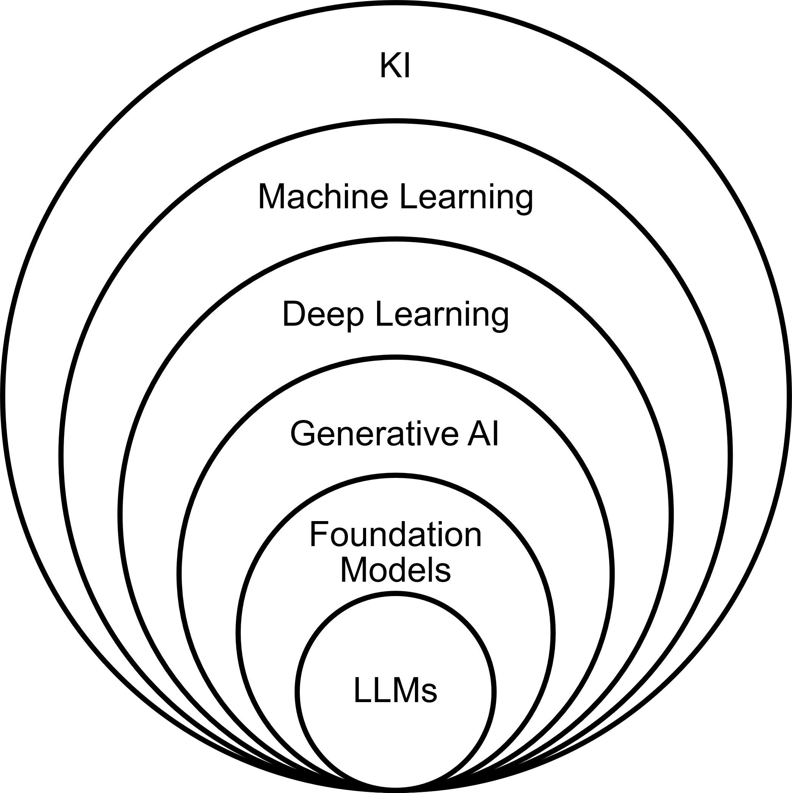
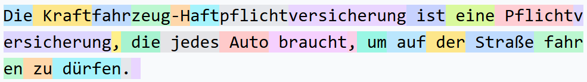
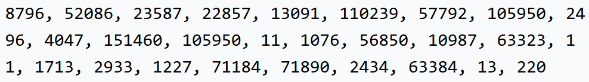
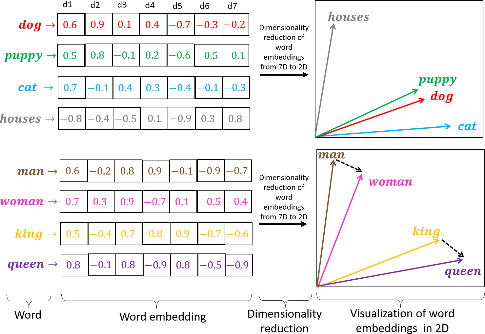
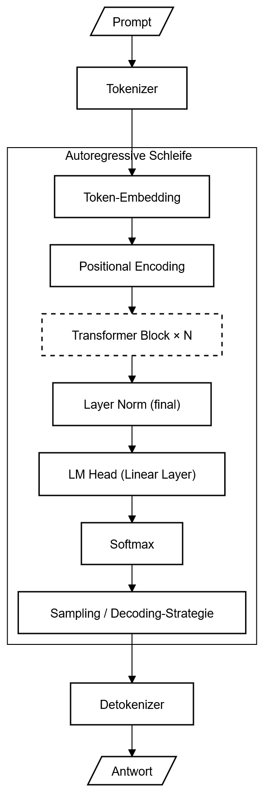
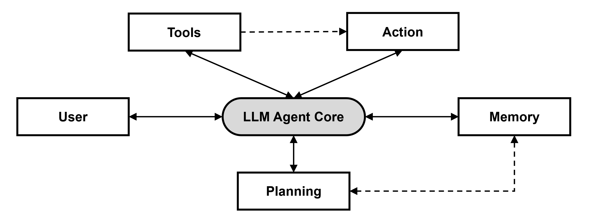

# Theoretische Grundlagen

In diesem Kapitel werden die theoretischen und methodischen Grundlagen dargelegt, die für die Entwicklung des in dieser Arbeit entworfenen KI-Agenten erforderlich sind. Die Darstellung erfolgt systematisch und schafft einen Bezugsrahmen, der es ermöglicht, die in den späteren Kapiteln beschriebenen Design- und Entwicklungsentscheidungen nachvollziehbar einzuordnen.

Im ersten Abschnitt (Kapitel 2.1) erfolgt eine Einführung in die zentralen Konzepte der Künstlichen Intelligenz. Neben der historischen Entwicklung werden fundamentale technische Ansätze erläutert, darunter Künstliche Intelligenz und Large Language Models. Darüber hinaus werden Grundlagen des Prompt Engineerings und agentische Systeme vorgestellt. Außerdem werden regulatorische Anforderungen, insbesondere im Kontext des EU AI Acts, analysiert und eingeordnet. In Kapitel 2.2 wird auf die wissenschaftlichen Methoden eingegangen, die dieser Arbeit zugrunde liegen. Der Fokus liegt auf dem Design Science Research Ansatz sowie der Evaluationsmethodik, welche die empirische und konzeptionelle Fundierung des entwickelten Artefakts sicherstellen. In Kapitel 2.3 werden die theoretischen Grundlagen des Projektmanagements behandelt. Die Darstellung relevanter Phasenmodelle ermöglicht eine angemessene Verortung des späteren Anwendungsszenarios des KI-Agenten im Kontext des Hochvoltspeicher-Produktionsnetzwerks.

Durch die in diesem Kapitel erfolgte Zusammenführung technischer, methodischer und organisatorischer Grundlagen wurde ein ganzheitlicher Rahmen geschaffen, der für das Verständnis der Forschungsarbeit sowie für die Einbettung des entwickelten Artefakts in den industriellen Anwendungskontext essenziell ist.

## Künstliche Intelligenz

Künstliche Intelligenz (KI) hat in den letzten Jahren eine bemerkenswerte Dynamik entfaltet und sich zu einem zentralen Innovationsmotor in Wissenschaft, Gesellschaft und Wirtschaft entwickelt. Die kontinuierlich steigende Signifikanz von KI manifestiert sich in der Diversität an neuen Anwendungen und technischen Fortschritten, die sowohl den Alltag als auch institutionelle Strukturen nachhaltig beeinflussen. Das vorliegende Kapitel 2.1 bietet eine grundlegende Einführung in die Thematik und fungiert als Ausgangspunkt für die detaillierte Betrachtung der nachfolgenden Unterkapitel. Zunächst erfolgt eine Erläuterung der historischen Entwicklung der KI, gefolgt von einer detaillierten Einordnung und Abgrenzung diverser technologischer Ansätze. Im weiteren Verlauf werden wesentliche technische Konzepte erörtert, darunter die Funktionsweise von Large Language Models (LLMs), Aspekte des Prompt Engineerings und agentische Systeme. Abschließend wird ein Überblick zu relevanten Compliance-Themen gegeben. Dieses strukturierte Vorgehen ermöglicht eine fundierte Kontextualisierung der theoretischen Grundlagen und schafft die Basis für weiterführende Analysen im Rahmen dieser Arbeit.

### Historische Entwicklung und Einordnung

Zunächst ist es erforderlich, den Begriff „Künstliche Intelligenz“ (KI) zu definieren. Innerhalb der Wissenschaft gibt es keine eindeutige Definition von KI. Im Folgenden werden drei Definitionen aus drei verschiedenen Zeiträumen einer Betrachtung unterzogen.

Tabelle 1: Drei Definitionen von KI (High-Level Expert Group on Artificial Intelligence, 2018; McCarthy et al., 1955; Rich & Knight, 2009)

| Jahr | Autor | Definition |
| --- | --- | --- |
| 1955 | McCarthy et al. | The development of machines that behave as if they possess intelligence. |
| 1991 | Rich and Knight | The study of how to make computers perform tasks at which humans currently excel. |
| 2018 | Expertengruppe KI, Europäische Kommission | Artificial intelligence (AI) refers to systems that display intelligent behaviour by analysing their environment and taking actions – with some degree of autonomy – to achieve specific goals. AI-based systems can be purely software-based, acting in the virtual world (e.g. voice assistants, image analysis software, search engines, speech and face recognition systems) or AI can be embedded in hardware devices (e.g. advanced robots, autonomous cars, drones or Internet of Things applications). |

**Einführung und gesellschaftliche Relevanz**

Die rasanten Fortschritte im Bereich der künstlichen Intelligenz haben die Grenzen zwischen menschlicher Kreativität und maschinell generierten Ergebnissen zunehmend verwischt und damit eine tiefgreifende Diskussion über die Fähigkeiten von KI im Vergleich zur menschlichen Intelligenz ausgelöst. Diese Entwicklungen erstrecken sich über zahlreiche Anwendungsbereiche und werfen grundlegende Fragen hinsichtlich der Umgestaltung der Arbeitswelt sowie der veränderten Rolle des Menschen im beruflichen Kontext auf. Insbesondere im wirtschaftlichen Umfeld zeigt sich das transformative Potenzial von KI in vielfältiger Weise: Neben der Förderung kreativer Prozesse ermöglicht die Technologie Unternehmen, Geschäftsprozesse zu optimieren, datenbasierte Entscheidungen zu treffen und neue Wertschöpfungspotenziale zu erschließen. Der gezielte Einsatz von KI zur effizienten Informationsbeschaffung und -verarbeitung hat beispielsweise dazu geführt, dass die Produktivität und Qualität von Finanzdienstleistungen deutlich gesteigert werden konnte. Dies unterstreicht die Relevanz von KI für strategische Entscheidungsfindungen in komplexen, hochdynamischen Umgebungen. Ein zukunftsweisender Ansatz findet sich im Konzept der „Industrie 5.0“, das über reine Effizienzsteigerung und Automatisierung hinausgeht. Im Fokus steht hierbei die synergetische Zusammenarbeit von Mensch und intelligenten Systemen, wobei die Aspekte Nachhaltigkeit und gesellschaftlicher Mehrwert gezielt adressiert werden. Die Unternehmenslandschaft hat sich bis zum Jahr 2024 grundlegend gewandelt und ist weiterhin im Umbruch. Unternehmen wie Apple, Microsoft und Nvidia nehmen gegenwärtig führende Positionen auf dem globalen Markt ein, indem sie konsequent auf digitale Plattformen und datengetriebene Geschäftsmodelle setzen. Diese Akteure haben die Bedeutung der Verbindung von Daten und künstlicher Intelligenz für die Wertschöpfung in der modernen Wirtschaft erkannt. Ihre Marktdominanz verdeutlicht, dass Unternehmen, die das Potenzial von Daten und KI umfassend nutzen, nicht nur bestehende Branchen disruptiv verändern, sondern diese auch nachhaltig und grundlegend neu gestalten. (Urbach & Feulner, 2026)

**Historische Entwicklung**

Die theoretischen Grundbausteine der künstlichen Intelligenz, insbesondere die Entwicklung von Algorithmen zur Lösung komplexer Aufgaben, wurden bereits in den frühen Jahrzehnten der KI-Forschung gelegt. Trotz dieser fundamentalen Fortschritte blieb die praktische Umsetzung und Anwendung dieser Konzepte zunächst limitiert, da die dafür erforderliche Rechenleistung fehlte. Erst mit dem kontinuierlichen Anstieg der verfügbaren Hardwarekapazitäten und der damit verbundenen exponentiellen Steigerung der Verarbeitungsleistung konnten viele der ursprünglich formulierten Ansätze und Methoden erfolgreich implementiert und weiterentwickelt werden. Die historische Entwicklung der künstlichen Intelligenz ist durch zahlreiche Meilensteine geprägt, die den Fortschritt in diesem Forschungsfeld maßgeblich beeinflusst haben. Die nachfolgende Abbildung 1 veranschaulicht einige zentrale Stationen der historischen Entwicklung im Bereich KI. Neben diesen bekannten Meilensteinen existieren jedoch eine Vielzahl weiterer bedeutender Fortschritte, die zur heutigen Leistungsfähigkeit und Anwendungsbreite der künstlichen Intelligenz beigetragen haben.

Abbildung 1: Historische Meilensteine der Künstlichen Intelligenz

Ein grundlegender Meilenstein in der KI-Forschung wurde bereits im Jahr 1950 von Alan Turing mit der Publikation „Computing Machinery and Intelligence“ gelegt. In diesem Werk entwickelte er den nach ihm benannten Turing-Test, der als methodischer Ansatz zur Überprüfung des intelligenten Verhaltens von Maschinen dient (Paaß & Hecker, 2024) (Urbach & Feulner, 2026). Im Jahr 1956 wurde der Begriff der KI erstmalig im Rahmen der Dartmouth-Konferenz durch John McCarthy und weitere Wissenschaftler, wodurch eine neue Forschungsdisziplin begründet wurde (Paaß & Hecker, 2024; Urbach & Feulner, 2026). Ein weiterer bedeutender Fortschritt wurde 1957 durch Frank Rosenblatt erzielt, der mit der Entwicklung des Perzeptrons ein lernfähiges künstliches neuronales Netz präsentierte, das in der Lage war, einfache Muster zu erkennen (Paaß & Hecker, 2024). Im Jahr 1966 gelang es Joseph Weizenbaum mit dem Programm ELIZA, eine Simulation einer scheinbar intelligenten Konversation zu entwickeln. Diese zeigte das Potenzial von KI im Bereich der natürlichen Sprachverarbeitung auf (Urbach & Feulner, 2026). Im Jahr 1986 demonstrierten Geoffrey Hinton und seine Kollegen die Wirksamkeit des Backpropagation-Algorithmus zur Mustererkennung in mehrschichtigen neuronalen Netzen und schufen damit die Grundlage für spätere Fortschritte im Deep Learning (Paaß & Hecker, 2024). Einen weiteren historischen Meilenstein markierte das Jahr 1997, als IBMs Schachcomputer Deep Blue den amtierenden Schachweltmeister besiegte und die Leistungsfähigkeit spezialisierter KI-Systeme unter Beweis stellte (Urbach & Feulner, 2026). Im Jahr 2011 gewann das von IBM entwickelte Computersystem Watson die US-amerikanische Quizshow „Jeopardy!“. Dieser Erfolg demonstrierte eindrucksvoll die Fähigkeit von KI, natürliche Sprache zu verarbeiten und zu verstehen (Urbach & Feulner, 2026). Im Jahr 2015 stellten Kaiming He und Kollegen ein tiefes neuronales Netzwerk vor, das über 152 Schichten verfügte und dazu in der Lage war, Bilder mit einer höheren Genauigkeit als der Mensch zu klassifizieren (Paaß & Hecker, 2024). Der Sieg von AlphaGo, einer Entwicklung von Google DeepMind, über den amtierenden Weltmeister im Brettspiel Go im Jahr 2016 , markierte einen bedeutenden Meilenstein in der Entwicklung von KI in komplexen, nicht-deterministischen Problembereichen (Urbach & Feulner, 2026). Im Jahr 2022 erfolgte die Veröffentlichung des KI-Chatbots „ChatGPT“ durch OpenAI, der durch seine fortschrittlichen Fähigkeiten in der Verarbeitung und Generierung natürlicher Sprache eine breite Aufmerksamkeit erlangte (Urbach & Feulner, 2026). Im darauffolgenden Jahr 2023 bestand das von OpenAI entwickelte Modell GPT-4 einen AGI-Intelligenztest, womit ihm ein mit dem Menschen vergleichbares Intelligenzniveau zugesprochen wurde (Ertel, 2025).

**Technologische Treiber / Entwicklungsbooster**

Die signifikanten Fortschritte im Bereich der KI, besonders generativer KI sind, wie bereits dargelegt, auf die technologischen Fortschritte zurückzuführen. Cao et al. (2023) analysieren drei zentrale technologische Treiber. Im Hinblick auf die *Hardware* ist festzustellen, dass sich das Training durch den Einsatz von rechenstarker Hardware beschleunigen lässt. Als Beispiele für derartige Hardware-Komponenten können der A100 von NVIDIA sowie die Tensor Processing Units (TPU) von Google angeführt werden. Dies ermöglicht die Verwendung größerer und komplexerer neuronaler Netzwerke, die in deutlich kürzerer Zeit trainiert werden können. Ursprünglich wurde Machine Learning auf einem Gerät mit einem Prozessor durchgeführt, was für kleine Datensätze und Modelle grundsätzlich funktioniert. Der Ansatz des *Distributed Learnings* ermöglicht die Aufteilung von Trainings-Workloads auf verschiedene Geräte oder Prozessoren, wodurch die Modelle signifikant schneller trainiert werden können. Standardisierte Frameworks können einen signifikanten Beitrag zur Steigerung der Effizienz und zur Vereinfachung des Prozesses leisten. Die ursprüngliche Entwicklung von Modellen erfolgte lokal. Die Verfügbarkeit von leistungsstarkem *Cloud Computing* (die Hauptakteure sind AWS und Azure) ermöglichte es den Entwicklern, die rechenintensiven Deep-Learning-Aufgaben über große Cluster an GPU oder TPU großskalierte Modelle zu trainieren. Die vorliegenden drei Entwicklungsbooster haben dazu beigetragen, dass zunehmend komplexere, größere und präzisere Modelle trainiert werden können. (Cao et al., 2023)

### Generative KI und Large Language Models

Um die technologische Basis dieser komplexen, modernen Modelle einzuordnen, ist zunächst eine grundlegende Klassifizierung der Künstlichen Intelligenz (KI) erforderlich. Wie in

Abbildung 2 dargestellt, lässt sich das Feld der KI hierarchisch in verschiedene Teildisziplinen untergliedern. Ein zentraler Bestandteil ist das Machine Learning (ML), das Algorithmen umfasst, die Muster in Daten erkennen und aus diesen lernen, ohne für jede spezifische Aufgabe explizit programmiert zu werden. Eine tiefere Spezialisierung des ML stellt das sogenannte Deep Learning dar, welches auf dem Einsatz künstlicher neuronaler Netze basiert. Diese Netze sind in ihrer Struktur der Funktionsweise des menschlichen Gehirns nachempfunden. Sie bestehen aus mehreren Schichten von miteinander verbundenen Knotenpunkten (Neuronen), die in der Lage sind, hochkomplexe, nicht-lineare Zusammenhänge in großen Datenmengen zu verarbeiten und zu abstrahieren. (Urbach & Feulner, 2026)

Abbildung 2: Hierarchische Struktur von KI (in Anlehnung an (Urbach & Feulner, 2026))

Auf Basis dieser tiefen neuronalen Netze hat sich die Generative KI als eigenständiger, transformativer Bereich etabliert. Im Gegensatz zu traditionellen, diskriminativen Modellen – die Daten primär klassifizieren oder analysieren – zielt die Generative KI darauf ab, völlig neue, synthetische Inhalte wie Texte, Bilder, Audiodaten oder Code zu erschaffen. Innerhalb der Generativen KI bilden sogenannte Foundation Models die technologische Grundlage. Dabei handelt es sich um leistungsstarke Basismodelle, die unüberwacht mit einer massiven Datenmenge vortrainiert wurden und sich durch Feinabstimmung für eine Vielzahl von nachgelagerten Aufgaben adaptieren lassen (Cao et al., 2023). Es existieren unterschiedliche Modalitäten dieser Modelle, die sich von der Verarbeitung von Text über Bild und Ton bis hin zu Video erstrecken (Kalota, 2024). Für die vorliegende Arbeit sind insbesondere text- bzw. sprachgenerierende Modelle (Language Models, LM) von Relevanz, da sie zur Analyse und Generierung natürlicher Sprache fähig sind.

Diese vortrainierten Modelle lassen sich zentral in zwei Gruppen unterscheiden, die sich nach der Anzahl der Parameter im neuronalen Netz richten: klein (Millionen bis Milliarden Parameter) und groß (Hunderte Milliarden bis Trilliarden Parameter) (Kamath et al., 2024). Demzufolge existieren Small Language Models (SLM) sowie Large Language Models (LLM). Für die vorliegende Arbeit sind Letztere von Relevanz. LLMs sind darauf ausgelegt, kohärente und kontextuell korrekte Texte zu generieren. Dazu nutzen sie probabilistische Schlussfolgerungen und fortschrittliche neuronale Netzwerkarchitekturen (Urbach & Feulner, 2026). Die zentrale technische Funktionalität moderner LLMs ist die sogenannte Transformer- bzw. Decoder-Architektur (Vaswani et al., 2017) (Cao et al., 2023) (Zhao et al., 2025). Moderne LLMs lassen sich somit als generative, vortrainierte Transformer bezeichnen, was auf Englisch „generative pretrained transformer“ oder abgekürzt „GPT“ bedeutet. Das bekannteste Tool, welches diese Technologie nutzt, ist „ChatGPT“ von OpenAI (Kalota, 2024).

Nachfolgend werden verschiedene Aspekte behandelt, die für die Funktionalität autoregressiver Decoder-basierten Sprachmodelle relevant sind. Abschließend wird der Gesamtprozess in Abbildung 6 dargestellt und zusammengefasst erläutert.

**Tokenisierung und Embeddings (Der Input)**

Der eingegebene Text (Prompt) wird vom System nicht als Zeichenkette verarbeitet, sondern mithilfe des Tokenizers in kleinere Informationseinheiten, sogenannte Tokens, zerlegt. Ein Token kann dabei ein ganzes Wort, eine Silbe oder ein einzelnes Zeichen sein (vgl. Abbildung 3). So kann das Wort „Straße“ beispielsweise in die beiden Tokens „Stra“ und „ße“ aufgeteilt werden. Jedes dieser Tokens wird dann als Zahl (Token-ID) dargestellt, sodass die Tokens in einem maschinenlesbaren Format vorliegen. Mehrfach auftretende Werte werden durch dieselbe Zahl codiert. Die beim Tokenizing verwendete Kodierung ist in der Regel nicht fix, sondern wird von einem Algorithmus generiert. Dieser analysiert die Häufigkeiten aller Zeichenketten in den Trainingsdaten und verwendet möglichst lange, aber häufige Zeichenketten als Tokens, wobei eine Maximalzahl verschiedener Tokens nicht überschritten werden darf. Diese werden anschließend individuell verarbeitet. (Kamath et al., 2024) (Urbach & Feulner, 2026) (Ertel, 2025)

Abbildung 3: Beispiel für Tokenisierung (oben) mit dazugehörigen Token-IDs (unten) (in Anlehnung an (Dr. Julien Siebert & Patricia Kelbert, 2024)(Ertel, 2025))

Das Modell ist dadurch in der Lage, eine größere Bandbreite an Vokabular zu verarbeiten. Die Granularität ist dabei abhängig von der spezifischen Anwendung. Im Anschluss wird jedes Token in einen hochdimensionalen Zahlenvektor (Embedding) transformiert. Die vorliegende mathematische Repräsentation dient der Anordnung der Tokens in einem Vektorraum. In diesem Raum ist eine signifikante Korrelation zwischen Wörtern mit ähnlicher semantischer Bedeutung, wie beispielsweise „Hund“ und „Katze“, zu verzeichnen. (Kamath et al., 2024) (Urbach & Feulner, 2026) (Ertel, 2025)

Die intuitive Erfassung solcher hochdimensionalen Vektorräume stellt eine Herausforderung dar, da das menschliche Vorstellungsvermögen auf drei Dimensionen beschränkt ist. Zur Veranschaulichung wird daher oft eine Dimensionsreduktion vorgenommen. Abbildung 4 zeigt exemplarisch, wie ein 7-dimensionaler Raum auf zwei Dimensionen projiziert wird, um die Beziehungen zwischen den Wörtern sichtbar zu machen.

Abbildung 4: Vereinfachte Darstellung von Embeddings anhand Dimensionsreduktion (Rozado, 2020)

Die Werte innerhalb der Vektoren (Dimensionen d1–d7) repräsentieren abstrakte semantische oder syntaktische Eigenschaften. In Abbildung 4 wird beispielsweise deutlich, dass die Dimension d1 stark mit dem Konzept „Belebtheit“ korreliert: Lebewesen weisen hier hohe positive Werte auf, während unbelebte Objekte (z. B. „houses“) negative Werte zeigen. Ein trainiertes Embedding-Modell ordnet Wörter so an, dass diese semantischen Beziehungen erhalten bleiben. Zudem lassen sich relationale Konzepte als Vektorverschiebungen darstellen. Wie in der unteren rechten Ecke der Abbildung zu sehen ist, entspricht der Vektor, der „man“ zu „woman“ verschiebt, nahezu exakt jenem Vektor, der „king“ zu „queen“ führt. Dies verdeutlicht, dass das Modell die semantische Relation „Geschlecht“ als konstante Richtung im Vektorraum encodiert hat. (Rozado, 2020)

**Architektur der Modelle (Transformer, Attention-Mechanismus, Decoder)**

Moderne LLMs wie die GPT-Modelle von OpenAI basieren grundlegend auf der Transformer-Architektur. Sie löst Einschränkungen traditionellerer Modelle und wurde ursprünglich 2017 von Vaswani et al. für maschinelle Übersetzungen eingeführt (Vaswani et al., 2017). Die Architektur ermöglicht die parallele statt sequenzieller Verarbeitung ganzer Textsequenzen. Die zentrale Innovation dabei ist der Self-Attention-Mechanismus. (Cao et al., 2023)

Dieser berechnet, wie stark jedes Token in einem Satz mit allen anderen Tokens zusammenhängt. Dadurch kann das Modell den Kontext und die Bedeutung von Wörtern in einer Sequenz erfassen und sie anhand ihrer Relevanz zueinander gewichten. So kann es Wörter wie „Schloss” korrekt interpretieren, die sowohl für ein Gebäude als auch für eine Türverriegelung stehen können. (Urbach & Feulner, 2026)

Da der Transformer Textsequenzen parallel und nicht sequenziell verarbeitet, verfügt er von sich aus über kein Verständnis der Wortposition. Um syntaktische Unterschiede („Hund beißt Mann“ versus „Mann beißt Hund“) korrekt erfassen zu können, werden den Token-Vektoren daher vor der Verarbeitung Positionsinformationen überlagert, was als Positional Encoding bezeichnet wird (Vaswani et al., 2017). Der sogenannte Self-Attention-Mechanismus operiert dabei nach dem Prinzip von Query, Key und Value (QKV): Jedes Token erzeugt drei Vektoren. Der Query-Vektor repräsentiert eine Suchanfrage, der Key-Vektor fungiert als Etikett der verfügbaren Informationen und der Value-Vektor trägt den eigentlichen Informationsgehalt. Dieses Konzept ist vergleichbar mit einer Datenbankabfrage, bei der nach Relevanz gefiltert und der passende Inhalt zurückgegeben wird. Da ein einzelner Attention-Kopf jeweils nur eine Art von Beziehung zwischen Tokens erfassen kann, werden in modernen LLMs mehrere solcher Berechnungen parallel durchgeführt (Multi-Head Attention). Dies erlaubt es dem Modell, unterschiedliche Beziehungsarten wie grammatikalische Abhängigkeiten und semantische Ähnlichkeiten innerhalb derselben Schicht simultan zu modellieren. Im Anschluss an diese Attention-Berechnung durchlaufen die Daten innerhalb jedes Transformer-Blocks ein künstliches neuronales Netz. Hier findet ein Großteil der eigentlichen Informationsverarbeitung statt, indem die durch Attention gewichteten Informationen über nicht-lineare Transformationen abstrahiert werden. (Zhao et al., 2025) (Vaswani et al., 2017) (Paaß & Hecker, 2024) (Kamath et al., 2024)

Die aktuellen, auf dem neuesten Stand der Technik entsprechenden vortrainierten Sprachmodelle lassen sich in drei Kategorien unterteilen: maskierte Sprachmodelle (Encoder), autoregressive Sprachmodelle (Decoder) und Encoder-Decoder-Sprachmodelle. Für die vorliegende Arbeit sind lediglich Decoder-Modelle von Relevanz, da diese für die Textgenerierung ausgelegt sind. Der Decoder generiert einen für die jeweilige Aufgabe passenden Ausgabetext, indem er das nächste Wort vorhersagt und somit zusammenhängende Texte generieren kann (Ertel, 2025). (Cao et al., 2023) (Kamath et al., 2024)

**Output-Generierung und Wahrscheinlichkeiten (Sampling, Temperatur)**

Nach dem Decoder müssen die entstandenen Vorhersagewerte zunächst linearisiert werden. Anschließend erfolgt die Normalisierung (Softmax), wodurch eine Wahrscheinlichkeitsverteilung entsteht. Die Auswahl des potenziell nächsten Tokens erfolgt basierend auf dieser Wahrscheinlichkeitsverteilung. Dies ist es, was den diversen Output von LLMs ausmacht. Dieser stochastische Schritt wird als „Random Sampling“ bezeichnet. Zentrale Parameter zur Beeinflussung der Wahrscheinlichkeiten für das nächste Token sind „Temperatur“, „top-k“ und „top-p“. (Zhao et al., 2025)

Die Temperatur steuert die Zufälligkeit der Vorhersagen des Modells. Durch Verringern der Temperatur erhöht sich die Wahrscheinlichkeit, Wörter mit hoher Wahrscheinlichkeit auszuwählen. Durch Erhöhung der Temperatur verringert sich die Wahrscheinlichkeit, Wörter mit geringer Wahrscheinlichkeit auszuwählen. Bei einer Temperatur von 1 entspricht dies der Standard-Zufallsauswahl, was einen kreativen Output fördert. Wenn die Temperatur gegen 0 geht, ist der Output stark probabilistisch und daher unkreativ, aber mit gleichem Input eher reproduzierbar. (Urbach & Feulner, 2026) (Zhao et al., 2025)

Anders als bei der Temperatur-Sampling-Methode werden beim Top-k-Sampling die Tokens mit den geringsten Wahrscheinlichkeiten direkt abgeschnitten. Stattdessen werden die k obersten Token mit den höchsten Wahrscheinlichkeiten abgetastet. Während das Top-k-Sampling eine feste Anzahl an Token vorgibt und dabei die zugrunde liegende Wahrscheinlichkeitsverteilung dabei vernachlässigt, passt sich das Top-p-Sampling dynamisch an die Unsicherheit der Wahrscheinlichkeitsverteilung an. (Zhao et al., 2025)

Abbildung 5 veranschaulicht den Einfluss von Top-p und Top-k auf die Auswahl möglicher Token. Während top-k (k = 2) die zwei Tokens mit der höchsten Wahrscheinlichkeit fix zulässt, werden bei top-p-sampling (p = 0,96) die Tokens zugelassen, die kumuliert 96 % der Wahrscheinlichkeitsverteilung abdecken.

Abbildung 5: Top-p und Top-k Sampling visualisiert (in Anlehnung an (Lee et al., 2023))

Letztendlich wird nicht der Token direkt gewählt, sondern – analog zur Tokenisierung zu Beginn – nur die Token-ID. Deshalb muss über den Detokenizer wieder in die Zeichenkette umgewandelt werden. Das ausgewählte Token wird an den Prompt angehängt, und der Prozess beginnt mit dem nächsten Token von vorn. Das Modell generiert den Text somit autoregressiv, Token für Token. (Zhao et al., 2025)

**Gesamtprozess LLM (Zusammenfassung inkl. Abbildung)**

Der Inferenzprozess** **in autoregressiven Sprachmodellen mit Decoder-Architektur lässt sich als sequenzielle Pipeline beschreiben. Der zugrundeliegende Prozess ist in Abbildung 6 dargestellt und wird zusammenfassend einmal erläutert.

Abbildung 6: Inferenzprozess eines Decoder basierten LLMs (in Anlehnung an (Vaswani et al., 2017))

Der Inferenzprozess eines autoregressiven Sprachmodells vollzieht sich in mehreren aufeinanderfolgenden Stufen. Zunächst wird der eingehende Prompt durch den Tokenizer in eine Sequenz numerischer Token-IDs überführt (vgl. Abbildung 3). Im Anschluss werden diese in kontinuierliche Vektoren mit entsprechenden Dimensionen eingebettet (Token-Embedding). Diese Vektoren kodieren die semantische Grundbedeutung der Token (vgl. Abbildung 4). Da der Transformer von sich aus keine Reihenfolge verarbeiten kann, werden den Vektoren zusätzlich Positionsinformationen überlagert (Positional Encoding). Die nun vorbereiteten Vektoren durchlaufen iterativ N Transformer-Decoder-Blöcke, wobei N mit der Modellgröße skaliert. Nach der letzten Schicht des Transformers wird eine abschließende Normalisierung der Ausgaben (Layer Norm) durchgeführt. Gängige moderne Modelle wie GPT verwenden diese Variante. Im nächsten Schritt projiziert der Language Modeling Head, welcher ein weiteres neuronales Netz darstellt, die Ausgaben auf alle Wörter des Vokabulars. Daraus berechnet eine Softmax-Funktion eine Wahrscheinlichkeitsverteilung über alle möglichen nächsten Tokens. Das wahrscheinlichste Token wird durch Decodierungsverfahren wie Top-k-, Top-p-Sampling oder Temperatur-Anpassung ausgewählt und abschließend durch den Detokenizer in lesbaren Text umgewandelt. Nachdem die informationstechnische Verarbeitung während der Anwendung erläutert wurde, wird nachfolgend betrachtet, wie die Modelle diese Fähigkeiten initial erlangen.

**Training und Alignment von LLMs (Wie das Modell erschaffen wird)**

Das Training von Large Language Models (LLMs) erfolgt in der Regel in einem iterativen, dreistufigen Prozess, der sich in die Phasen Pre-Training (Vorabtraining), Fine-Tuning (Feinabstimmung) und Reinforcement Learning from Human Feedback (RLHF) untergliedert. (Urbach & Feulner, 2026)

Die erste Phase, das Pre-Training, basiert auf dem Konzept des selbstüberwachten Lernens (Self-Supervised Learning). Dabei wird das Modell mit massiven, unstrukturierten Datenmengen trainiert, die unter anderem aus Web-Scraping-Daten, Wikipedia-Artikeln, digitalisierten Büchern und Programmiercode bestehen (Kamath et al., 2024). Das primäre Ziel dieser Phase besteht darin, dass das Modell fundamentale sprachliche Muster, Grammatiken, Faktenwissen sowie logische Zusammenhänge erlernt. Technisch erfolgt dies durch die fortlaufende Vorhersage des potenziell nächsten Tokens innerhalb einer unvollständigen Textsequenz (Next-Token-Prediction). Durch Milliarden von Iterationen passt das neuronale Netz seine internen Parameter (Gewichte) so an, dass die Wahrscheinlichkeit für korrekte Vorhersagen kontinuierlich maximiert wird. In exakt diesem Schritt entstehen auch die zuvor beschriebenen Embeddings: Durch die Auswertung kontextueller Abhängigkeiten in den massiven Textdaten erlernt das Sprachmodell die semantischen Beziehungen der Tokens und positioniert diese als kontinuierliche Vektoren in jenem hochdimensionalen Raum, der die Grundlage für das maschinelle Sprachverständnis bildet. (Urbach & Feulner, 2026)

Auf das Pre-Training folgt das Fine-Tuning, das in der Praxis häufig als Supervised Fine-Tuning umgesetzt wird. Im Gegensatz zur ersten Phase kommt hierbei überwachtes Lernen (Supervised Learning) zum Einsatz. Es werden deutlich kleinere, jedoch qualitativ hochwertige und kuratierte Datensätze mit klar definierten Input-Output-Paaren verwendet. Das Ziel dieser Feinabstimmung besteht darin, das allgemeine Basismodell auf spezifische Anwendungsfälle, wie etwa Textzusammenfassungen, Frage-Antwort-Systeme oder Sentimentanalysen, zu spezialisieren. Dabei behält das Modell sein zuvor erworbenes generisches Basiswissen bei, generiert jedoch präzisere und kontextuell relevantere Antworten. Diese Kombination gewährleistet sowohl die notwendige Spezialisierung als auch die generelle Vielseitigkeit des Modells. (Urbach & Feulner, 2026)

Den Abschluss des Trainingsprozesses bildet das „Reinforcement Learning with Human Feedback“ (RLHF). In diesem Schritt wird das Modell durch bestärkendes Lernen (Reinforcement Learning) und menschliche Präferenzbewertungen iterativ optimiert. Das Hauptziel, das sogenannte „Alignment“, besteht darin, die Ausgaben des Modells an menschliche Erwartungen, Sicherheitsrichtlinien und ethische Standards anzugleichen. Durch die gezielte Belohnung hilfreicher Antworten und die Sanktionierung schädlicher, toxischer oder fehlerhafter Ausgaben wird ein robustes, sicheres und anpassungsfähiges Modell geschaffen, das sich für den direkten Interaktionseinsatz in der Praxis qualifiziert. (Urbach & Feulner, 2026)

Für die Entwicklung des in dieser Arbeit konzipierten KI-Agenten wird auf ein bereits vollständig trainiertes und ausgerichtetes Modell zurückgegriffen, weshalb kein eigenes Training stattfindet. Das Verständnis dieser Phasen ist jedoch essenziell, um die Leistungsfähigkeit, aber auch die potenziellen Grenzen und Halluzinationsrisiken des Modells im nachfolgenden industriellen Einsatz bewerten zu können.

**Grenzen**

Trotz der bemerkenswerten Fortschritte unterliegen Large Language Models systembedingten Grenzen, deren Kenntnis für den praktischen Einsatz unabdingbar ist. Eine primäre Limitation stellt das fehlende kognitive und inhaltliche Verständnis der Modelle dar. LLMs verfügen über keinerlei echte kognitive Fähigkeiten, wie etwa Empathie oder abstraktes Denken. Sie durchdringen die von ihnen verarbeiteten Inhalte nicht semantisch, sondern imitieren menschliche Denkergebnisse, logisches Schließen und Kreativität lediglich auf Basis hochkomplexer, statistischer Mustererkennung. Aus dieser rein probabilistischen Funktionsweise resultiert das Phänomen der „Halluzinationen“. Da LLMs ihre eigenen Ausgaben nicht auf empirische Wahrheit oder logische Konsistenz überprüfen können, generieren sie gelegentlich Informationen, die zwar plausibel und überzeugend klingen, faktisch jedoch falsch oder vollständig erfunden sind. In der Fachliteratur wird dieses Verhalten teilweise nicht als Fehler („Bug“), sondern als systeminhärente Eigenschaft („Feature“) der generativen Architektur beschrieben. Der Mechanismus, der kreative Texte ermöglicht, ist demnach identisch mit dem Mechanismus, der Fakten generiert. (Urbach & Feulner, 2026)

Eine weitere fundamentale Limitierung stellt der sogenannte Wissens-Cutoff dar. Da das in den neuronalen Gewichten verankerte Faktenwissen am Ende der Pre-Training-Phase statisch eingefroren wird, haben LLMs von Natur aus keinen Zugriff auf aktuelle Ereignisse oder spezifische Informationen, die nach diesem Zeitpunkt entstanden sind. Ebenso ist die Informationsmenge, die das Modell in einer einzelnen Interaktion simultan verarbeiten kann, durch das architekturbedingte Kontext-Fenster limitiert, was die gleichzeitige Auswertung umfangreicher Inputs erschwert. (Urbach & Feulner, 2026)

Zudem bergen die Modelle die Gefahr der Reproduktion von Vorurteilen. Durch den sogenannten Mirror-Effekt spiegeln und verstärken LLMs historische Ungleichheiten oder diskriminierende Biases, die in den unstrukturierten Trainingsdaten des Internets verankert sind. Zwar existieren technische Schutzmaßnahmen zur Abschwächung dieses Effekts (wie das zuvor beschriebene RLHF-Alignment), diese gelten jedoch als nicht unfehlbar. Zusätzlich zu diesen technischen Limitationen werfen LLMs komplexe rechtliche und ethische Fragestellungen auf. Das Training auf Basis massiver, aus dem Internet extrahierter Datensätze führt zu ungelösten urheberrechtlichen Konflikten und birgt das Risiko, dass unbeabsichtigt sensible oder personenbezogene Informationen in die Modellgewichte integriert und später preisgegeben werden. Da ein globaler Konsens für ethische und rechtliche Rahmenbedingungen bislang nicht erreicht werden konnte, reagiert die Gesetzgebung mit ersten regulatorischen Ansätzen, wie beispielsweise dem EU AI Act. Eine detaillierte Betrachtung dieser regulatorischen und rechtlichen Implikationen erfolgt in Kapitel 2.1.5. (Urbach & Feulner, 2026)

Um jedoch nicht nur statisch Wissen abzurufen, sondern um komplexe Aufgaben autonom zu lösen und den Output exakt zu steuern, sind gezielte Eingabetechniken (Prompt Engineering) und übergreifende Systemarchitekturen (Agentische Systeme) notwendig. Diese werden in den nachfolgenden Kapiteln 2.1.3 und 2.1.4 behandelt.

### Prompt Engineering

Prompt Engineering beschreibt die systematische Gestaltung, Strukturierung und Optimierung von Eingabeaufforderungen („Prompts“) für Large Language Models (LLMs), um deren Ausgaben inhaltlich, formal und kontextuell zu steuern (Chen et al., 2025; David & Ganesan, 2024; Deshmukh et al., 2025). Wissenschaftlich lässt sich Prompt Engineering an der Schnittstelle zwischen Mensch-Computer-Interaktion bzw. Natural Language Processing (NLP) einordnen (David & Ganesan, 2024). Letztendlich wird somit der Output des LLMs angepasst, ohne grundlegende Modellparameter des LLMs zu verändern (Sahoo et al., 2025; Sasaki et al., 2024) und gleichzeitig wird die Nutzbarkeit und Genauigkeit des LLMs für einen bestimmten Anwendungsfall dadurch maximiert (Chen et al., 2025). Vor allem um in komplexen, hochdynamischen Umgebungen effektiv und ethische KI-Kommunikation sicherzustellen, ist Prompt Engineering ein kritische Werkzeug (Deshmukh et al., 2025), da Defizite wie Halluzinationen, Biases oder Inkonsistenzen minimiert werden können (Chen et al., 2025; David & Ganesan, 2024; Deshmukh et al., 2025).

Ziel von Prompt Engineering ist immer die Sicherstellung der Modellausgaben an Nutzerintentionen. Der Prozess einen Prompt optimal zu gestalten ist komplex und bedarf sorgfältiges Design. In einem iterativen Prozess wird der Prompt verbessert, bis die generative KI den gewünschten Output liefert. Um die Praxis des Prompt Engineerings tiefer zu betrachten, wird die systematische Literaturrecherche von David und Ganesan (2024) herangezogen, in der verschiedene Herausforderungen, Methoden und Best Practices des Prompt Engineerings betrachtet werden. (David & Ganesan, 2024)

Prompt Engineering sieht sich mit einer Vielzahl von Herausforderungen konfrontiert, die sich signifikant auf die Qualität und Verlässlichkeit der Ausgaben auswirken. Eine primäre Herausforderung stellen Mehrdeutigkeiten und Unklarheiten in der Eingabeaufforderung dar, welche häufig irrelevante oder irreführende Resultate zur Folge haben. In engem Zusammenhang damit stehen Schwierigkeiten bei der Interpretation seitens der Large Language Models (LLMs), die potenziell zu einem fehlerhaften Verständnis der Nutzerintention führen können. Darüber hinaus besteht das inhärente Risiko, dass die Modelle Voreingenommenheiten (Bias) reproduzieren, die bereits in den zugrundeliegenden Trainingsdaten verankert sind. Auch die kontextuelle Relevanz ist kritisch zu betrachten. Eine fehlende Abstimmung der Eingabe auf den spezifischen Kontext resultiert oft in unpassenden Antworten. Ein signifikantes technisches Problem manifestiert sich in der mangelnden Konsistenz der Ergebnisse sowie dem Phänomen der „Halluzinationen“. Letztere bezeichnet die Generierung sachlich falscher Informationen. Schließlich ist der Prozess der Erstellung effektiver Prompts durch einen hohen Zeitaufwand gekennzeichnet, was die iterative Verfeinerung zu einer ressourcenintensiven Aufgabe macht. (David & Ganesan, 2024)

In Bezug auf die Gestaltung von Prompts lassen sich verschiedene Techniken und Methoden differenzieren, die zur Erstellung eines Prompts zum Einsatz kommen. Die einfachste Methode wird als „Zero-shot Prompting“ bezeichnet. Dabei wird lediglich ein einziger Prompt ohne weitere Beispiele als Input gegeben. Es besteht die Möglichkeit, diese Vorgehensweise zu erweitern, indem der Prompt um Beispiele ergänzt wird. Diese Beispiele können beispielsweise für Kontext, Antwortformat oder Verhalten von Relevanz sein. Das LLM verfügt durch diese Erweiterung über ein erweitertes Verständnis, was zu einer Annäherung der generierten Antwort an den gewünschten Output führt. In der praktischen Anwendung erweist sich die Verwendung strukturierter Prompts als gängig. Im vorliegenden Kontext werden unterschiedliche Kategorien, wie etwa die Rolle oder das Output-Format, präzise definiert. Eine weitere weit verbreitete Methode ist die sogenannte Retrieval-Augmented-Generation (RAG), womit externe Informationen abgerufen werden. Die ReAct-Methode (Reasoning and Act) begründet das Vorgehen zunächst (Reasoning) und handelt (Act) dann mit dem Verwenden von Tools oder dem Zugriff auf externe Datenbanken. Die umfassende Auflistung der Prompting-Techniken und -Methoden ist in Tabelle 2 dargestellt. (David & Ganesan, 2024)

Tabelle 2: Prompting Techniken und Methoden (David & Ganesan, 2024)

| Art | Beschreibung |
| --- | --- |
| Zero-shot Prompting | Das Modell generiert eine Antwort auf der Grundlage eines einzigen Prompts ohne vorherige Beispiele. |
| Few-shot Prompting | Das Modell wird mit einigen Beispielen bereitgestellt, um das Verständnis und die Generierung für neue Aufgaben zu erleichtern. |
| Structured Prompts | Hierzu gehören klare Komponenten wie Kontext, rollendefinierende Anweisungen und gewünschtes Ausgabeformat. |
| Chain-of-Thought (CoT) Prompting | Das Modell wird dazu angehalten, seine Argumentation Schritt für Schritt zu erläutern, bevor es eine endgültige Antwort gibt. |
| Tree-of-Thought (ToT) Prompting | Als Erweiterung von CoT untersucht diese Technik mehrere Argumentationswege, um die Problemlösung zu verbessern. |
| Self-Consistency Prompting | Für denselben Prompt werden mehrere Antworten generiert, und die konsistenteste Antwort wird ausgewählt. |
| Retrieval-Augmented Generation (RAG) | Das Modell ruft relevante Informationen aus externen Quellen ab, bevor es eine Antwort generiert. |
| ReAct (Reason and Act) Prompting | Das Modell integriert Schlussfolgerungen und Handlungen, wie beispielsweise die Suche in externen Datenbanken. |
| The CLEAR Framework | Dieses Rahmenwerk betont prägnante, logische, explizite, adaptive und restriktive Prinzipien für ein schnelles Design. |

David und Ganesan betrachten auch erfolgreiche Lösungsansätze, was die ganzheitliche Betrachtung abrundet. Die in Tabelle 3 dargestellten Best Practices fassen zentrale Empfehlungen zusammen und bilden die Grundlage für ein systematisches und reproduzierbares Prompt-Design.

Tabelle 3: Best Practices für gutes Prompt Design (David & Ganesan, 2024)

| Art | Beschreibung |
| --- | --- |
| Klarheit und Spezifität | Ein klarer und fokussierter Prompt ist für die Erzielung genauer Ergebnisse unerlässlich. Vage Prompts können zu irrelevanten oder irreführenden Ergebnissen führen, während spezifische Prompts dazu beitragen, das beabsichtigte Ziel zu erreichen. |
| Kontext | Durch die Bereitstellung relevanter Hintergrundinformationen kann das Modell genauere und kontextbezogenere Antworten generieren. |
| Gewünschtes Format und Ausführlichkeit | Durch die Angabe des Formats und der Länge der gewünschten Ausgabe werden strukturierte und prägnante Antworten gewährleistet. |
| Aktionsverben und Beispiele | Die Verwendung starker Aktionsverben und die Einbeziehung von Beispielen kann die KI zur gewünschten Aktion führen und die Leistung verbessern. |
| Iterative Verfeinerung | Prompt Engineering ist ein iterativer Prozess, der kontinuierliche Tests und Anpassungen erfordert, um die Ergebnisse zu optimieren. |

Ein abschließender Aspekt ist die Sprache. LLMs werden in der Regel primär mit englischsprachigen Daten trainiert. Die Verwendung nicht-englischer Prompts bei bereits trainierten Modellen führt in der Regel zu einer reduzierten Leistung. Eine ausgeglichenere Performance über verschiedene Sprachen hinweg lässt sich durch die Neu-Trainieren des Modells mit multilingualen Prompts erreichen. Zwar wird dadurch die Sprachbarriere gelöst, jedoch ist eine Abnahme der Performance bei rein englischen Prompts zu beobachten. (Ozsoy, 2024)

### Agentische Systeme

**Definition und Abgrenzung (Chatbot vs. Agent)**

Um die technologische Basis des in dieser Arbeit entwickelten Systems zu fundieren, ist eine präzise terminologische und funktionale Abgrenzung zwischen klassischen Sprachmodellen, konventionellen Chatbots und vollumfänglichen agentischen Systemen erforderlich. Im Bereich der künstlichen Intelligenz profitieren insbesondere konversationelle Anwendungen und Chatbots am stärksten von der Leistungsfähigkeit aktueller LLMs. Konversationelle generative KI-Agenten, wie beispielsweise ChatGPT, revolutionieren dabei die Mensch-KI-Interaktion und bilden die funktionale Brücke zwischen komplexen Basismodellen und deren praktischer Anwendbarkeit. Sie nutzen LLMs für dynamische, menschenähnliche Dialoge und unterstützen die Nutzer flexibel bei unterschiedlichsten Aufgabenstellungen. Die signifikanteste Verbesserung dieser Modelle gegenüber traditionellen Ansätzen liegt im natürlichen Sprachverständnis. LLMs erfassen die Intention der Anwender präzise und kombinieren diese mit internem Wissen, um sinnhafte und kontextuelle Antworten zu generieren. Für die Qualität der Interaktion ist zudem die Kontextverfolgung über offene, themenwechselnde Gespräche hinweg von entscheidender Bedeutung. In längeren Multi-Turn-Dialogen können die Modelle selektiv auf frühere Anfragen und Antworten zurückgreifen, um die Kohärenz des Gesprächs zu wahren. Ermöglicht wird dies durch jüngste technische Verbesserungen, die das Schlussfolgern über deutlich erweiterte Textmengen und Kontextlängen hinweg zulassen. (Kamath et al., 2024) (Urbach & Feulner, 2026)

Die historische und technische Entwicklung solcher Dialogsysteme lässt sich nach Urbach & Feulner (2026) in drei zentrale Kategorien unterteilen. Die erste Kategorie umfasst regelbasierte Systeme, die strikt nach vordefinierten Mustern arbeiten. Während diese in stark strukturierten Szenarien äußerst zuverlässig agieren, erweisen sie sich bei unerwarteten Eingaben als unflexibel. Eine Weiterentwicklung stellen Abruf-basierte Systeme in der zweiten Kategorie dar, welche die passendste Antwort aus einer bestehenden Datenbank auswählen. Diese agieren zwar kontextbezogener, sind jedoch nicht in der Lage, völlig neue Antworten zu generieren. Die dritte und fortschrittlichste Entwicklungsstufe bilden generative Modelle wie ChatGPT. Diese generieren in Echtzeit dynamisch neue Antworten auf Basis ihrer Trainingsdaten und können äußerst flexibel auf komplexe, vielfältige oder unerwartete Situationen reagieren. (Urbach & Feulner, 2026)

Trotz der signifikanten Fortschritte generativer Modelle im Bereich des natürlichen Sprachverständnisses weisen isolierte Large Language Models in der praktischen Anwendung jedoch strukturelle Limitierungen auf. Standard-Sprachmodelle eignen sich hervorragend für die reine Textgenerierung, scheitern jedoch oft an komplexen, mehrstufigen Aufgaben, die ein langanhaltendes Gedächtnis, die Nutzung externer Werkzeuge oder strategische Planung erfordern. Aufgrund dieser Restriktionen vollzieht sich eine Evolution hin zur agentischen KI. Ein agentisches System grenzt sich dadurch ab, dass es autonom, zielgerichtet und adaptiv handelt. Es ermöglicht ein iteratives Problemlösen und interagiert aktiv mit externen Umgebungen, anstatt lediglich statische Antworten zu liefern. (Urbach & Feulner, 2026)

Um die Grenzen reiner Sprachmodelle zu überwinden, findet ein Paradigmenwechsel statt, bei dem das LLM lediglich als kognitiver Kern einer umfassenderen Architektur fungiert. Die Kombination des Sprachmodells mit zusätzlichen funktionalen Komponenten führt zu einer Leistungssteigerung, die isolierte Modelle in der Aufgabenerfüllung deutlich übertrifft. Zu den wesentlichen Abgrenzungsmerkmalen agentischer Systeme gehört die Integration eines Gedächtnisses (Memory), welches Informationen aus früheren Interaktionen speichert und so kohärente, kontextbezogene Antworten selbst bei sehr langen Unterhaltungen sicherstellt. Ein weiteres Kernmerkmal ist die Planungsfähigkeit: Komplexe Aufgaben werden für ein systematisches Problemlösen und für strategische Entscheidungen in strukturierte Einzelschritte zerlegt. Darüber hinaus befähigt die Anbindung externer Tools – wie etwa Code-Interpreter, Taschenrechner oder Datenbanken für aktuelle Datenabrufe – das System zu Handlungen weit über die Generierung von Text hinaus. Durch diese tiefe Integration transformieren sich statische LLMs zu autonomen und effizienten KI-Agenten, die in der Lage sind, vielfältigere Aufgaben deutlich präziser und anpassungsfähiger zu lösen. (Urbach & Feulner, 2026)

**Architektur und Kernkomponenten**

Die funktionale Überlegenheit agentischer Systeme gegenüber statischen Sprachmodellen resultiert aus einer modularen Systemarchitektur, die das zugrunde liegende Large Language Model um spezifische kognitive und operative Komponenten erweitert. Der interne Aufbau dieser intelligenten Agentensysteme stützt sich maßgeblich auf Reasoning-augmented LLMs, welche als analytisches Zentrum fungieren. Diese erweiterten Sprachmodelle sind in der Lage, komplexe Problemstellungen in ihre Einzelteile zu zerlegen, alternative Lösungswege systematisch zu bewerten und ein logisches, mehrstufiges Schließen zu ermöglichen. Als primäre Schnittstelle zum Anwender dienen dabei konversationelle Agenten. Sie verwalten nicht nur den Dialogkontext über längere Zeiträume, sondern übernehmen auch die essenzielle Aufgabe, menschliche Absichten präzise zu interpretieren und in maschinell ausführbare Handlungen zu übersetzen. Um die Limitierungen des statischen Trainingswissens eines Modells zu überwinden, wird die Architektur häufig um das Konzept der Retrieval-Augmented Generation (RAG) ergänzt. Diese Technologie integriert externe, hochaktuelle Wissensquellen wie Datenbanken oder APIs direkt in den Generierungsprozess. Für die Bewältigung besonders komplexer und umfangreicher Aufgabenstellungen kommen zudem Multi-Agenten-Systeme zum Einsatz. In diesen Netzwerken kooperieren mehrere spezialisierte Agenten – beispielsweise in den Rollen als Planer, Kritiker oder Ausführer –, um Probleme skalierbar und arbeitsteilig zu lösen. (Urbach & Feulner, 2026)

Ein zentrales Element dieser modularen Architektur, das die Grundlage für langanhaltende und kohärente Interaktionen bildet, ist das systematische Memory Handling. Im Gegensatz zur menschlichen Erinnerung basiert das "Gedächtnis" einer KI nicht auf organischem Speichern, sondern auf der strukturierten und iterativen Mitgabe der gesamten bisherigen Interaktionshistorie. Durch diese fortlaufende Integration des bisherigen Gesprächsverlaufs in neue Eingaben wird die Kontexterhaltung innerhalb des Dialogsystems sichergestellt. Der primäre Zweck dieses Mechanismus besteht darin, kohärente Dialoge aufrechtzuerhalten und die korrekte Interpretation von thematischen Folgefragen zu gewährleisten. Die technische Umsetzung dieses Konzeptes unterliegt jedoch limitierenden Restriktionen, die maßgebliche Implikationen für das Systemdesign nach sich ziehen. Die größte Herausforderung im Memory Management stellen die technologischen Token-Limits der Sprachmodelle dar, welche die maximal verarbeitbare Textmenge pro Anfrage strikt begrenzen. Bei besonders langen Unterhaltungen muss die mitgegebene Historie zwangsläufig gekürzt oder durch das System zusammengefasst werden, was potenziell zu einem schleichenden Informationsverlust führen kann. Um dieser Problematik zu begegnen, erfordert das Systemdesign von Seiten der Entwickler robuste Mechanismen, die sicherstellen, dass stets die relevantesten und aktuellsten Gesprächsinhalte priorisiert und dem Modell zur Verarbeitung übergeben werden. (Urbach & Feulner, 2026)

Abbildung 7: High-Level Module eines LLM-basierten Agenten (in Anlehnung an (Kamath et al., 2024) (Urbach & Feulner, 2026)

**Orchestrierung, Werkzeugnutzung und Wissensanbindung**

Die operative Wirksamkeit eines KI-Agenten in komplexen Anwendungsfällen erfordert Mechanismen zur dynamischen Informationsbeschaffung und zur Interaktion mit externen Systemen, da die reinen Planungsfähigkeiten des zugrunde liegenden Sprachmodells allein nicht ausreichen. Die Basis der Planung und Entscheidungsfindung von agentischen Systemen bildet das LLM. Im Gegensatz zu klassischen Algorithmen oder reinem Reinforcement Learning, beziehen diese Agenten ihre Handlungspläne und ihr tiefes Absichtsverständnis direkt aus der natürlichen Sprache des Modells. Ergänzt wird dieses kognitive Zentrum durch ein Aktionsmodul, welches getroffene Entscheidungen in konkrete Ergebnisse umsetzt, aktiv mit der Systemumgebung interagiert und den Erfolg von Handlungen durch kontinuierliches Feedback validiert. Insbesondere in der Robotik oder im autonomen Fahren kommt zusätzlich ein Wahrnehmungsmodul zum Einsatz, das multimodale Umgebungsinformationen – analog zu menschlichen Sinnen – erfasst und in eine einheitliche maschinenlesbare Repräsentation umwandelt. (Huang, 2024)

Obwohl diese sprachmodellbasierte Entscheidungsfindung klassische algorithmische Ansätze in ihrer Flexibilität deutlich übertrifft, unterliegt sie inhärenten Limitationen, die einen uneingeschränkten Einsatz, besonders in sicherheitskritischen Unternehmenskontexten, erschweren. Isolierte LLMs weisen strukturelle Schwächen auf, darunter ein erhebliches Risiko von Halluzinationen, fehlerhafte Wissensabrufe sowie eine mangelnde Transparenz in ihren Schlussfolgerungsprozessen. Insbesondere in Hochrisikobereichen erweist sich zudem die Anfälligkeit der Modelle gegenüber feindlichen Angriffen als kritischer Schwachpunkt. Um diese Defizite zu kompensieren, ist die Integration spezialisierter Tools zwingend notwendig. Externe Werkzeuge wie APIs, Wissensdatenbanken oder spezialisierte Sub-Modelle ergänzen das fehlende Fachwissen und machen domänenspezifische Expertise nutzbar. Durch die Einbindung solcher Hilfsmittel lassen sich die Handlungsfähigkeit, die Anpassungsfähigkeit und letztlich die Entscheidungsqualität von KI-Agenten signifikant steigern. (Huang, 2024)

Um den beschriebenen technischen Grenzen – vorrangig den Halluzinationen und dem veralteten Faktenwissen durch den Knowledge Cut-off des Trainings – auf architektonischer Ebene methodisch zu begegnen, hat sich das Paradigma der Retrieval-Augmented Generation (RAG) als maßgeblicher Lösungsansatz etabliert. Das Grundprinzip von RAG besteht in der Kombination eines Large Language Models mit einem dedizierten Abrufsystem für externes Wissen. Ziel ist es, die Qualität, Genauigkeit und Verlässlichkeit der Textgenerierung grundlegend zu verbessern. Der Prozess verläuft dabei zweistufig: In der Retrieval-Phase (Abruf) identifiziert ein System zunächst thematisch relevante Dokumente aus einer angebundenen, externen Wissensdatenbank. In der anschließenden Generation-Phase (Generierung) nutzt das LLM diese präzise abgerufenen Informationen als fundierten und verifizierten Kontext für die Erstellung seiner finalen Antwort. (Urbach & Feulner, 2026)

Die Implementierung der RAG-Architektur bietet weitreichende Vorteile für den produktiven Einsatz. Da die generierten Texte direkt auf verifizierten, externen Fakten basieren, wird die Wahrscheinlichkeit für fehlerhafte oder halluzinierte Informationen auf ein Minimum reduziert. Zudem gewährleistet die Entkopplung von Wissen und Modell eine hohe Aktualität und Systemeffizienz: Die externe Wissensdatenbank kann jederzeit und ohne nennenswerten Rechenaufwand aktualisiert werden, ohne dass ein ressourcenintensives Neu-Training des gesamten Sprachmodells erforderlich ist. Ein weiterer entscheidender Vorteil ist die erhöhte Transparenz, da die vom System herangezogenen Quellen für den Nutzer einsehbar und überprüfbar sind, was das Vertrauen in die Technologie nachhaltig stärkt. Aus diesen Gründen erweist sich RAG als besonders wertvoll für professionelle Domänen wie Medizin, Rechtsprechung oder auch ingenieurswissenschaftliche Produktionsnetzwerke, in denen höchste faktische Präzision eine zwingende Voraussetzung für den Einsatz von KI darstellt. (Urbach & Feulner, 2026)

**Autonomiegrad und Mensch-KI-Interaktion**

Mit der zunehmenden Befähigung von KI-Agenten zur eigenständigen Werkzeugnutzung und Informationsbeschaffung rückt die Frage nach dem optimalen Autonomiegrad und der adäquaten Einbindung des menschlichen Akteurs in das Zentrum der Systemgestaltung. Während eine hohe Autonomie die operative Effizienz in komplexen Umgebungen signifikant steigert, birgt sie gleichzeitig erhebliche Risiken hinsichtlich eines potenziellen Kontrollverlusts. Vollautonome KI-Agenten erschweren naturgemäß das unmittelbare Eingreifen des Nutzers in laufende Prozesse. Diese Distanz zwischen Systemhandlung und menschlicher Überwachung führt in hochdynamischen und kritischen Umgebungen häufig zu verzögerten Fehlerkorrekturen. Ein zentraler Aspekt der Systemauslegung betrifft folglich die Benutzerfreundlichkeit der erforderlichen Kontrollmechanismen. Werden Anwender durch komplexe Eingriffsmöglichkeiten überfordert oder verwirrt, resultiert dies unweigerlich in einem Vertrauens- sowie einem signifikanten Effektivitätsverlust hinsichtlich der gesamten Mensch-KI-Kollaboration. (Brohi et al., 2025)

Um diesen operationalen Risiken auf Systemebene systematisch zu begegnen, erfordert die Interaktionsebene der Agentenarchitektur Mechanismen, die eine kontinuierliche und intuitive Überwachung durch den Anwender gewährleisten. Im Fokus steht dabei ein kollaboratives Systemdesign, welches die menschliche Aufsicht zu jeder Zeit strukturell sicherstellt. Hierfür benötigen moderne Agentensysteme transparente Statusberichte über ihre Handlungsabsichten, interaktive Debugging-Tools zur Nachvollziehbarkeit getroffener Entscheidungen sowie unmittelbare, manuelle Übersteuerungsmechanismen, um den autonomen Handlungsprozess im Bedarfsfall abzubrechen oder zu korrigieren. Eine zentrale Lösung bietet dabei das Paradigma der geteilten Kontrolle. Ein flexibler und kontextabhängiger Wechsel der Kontrollinstanz zwischen dem KI-System und dem menschlichen Akteur schafft ein belastbares Gleichgewicht aus maschineller Effizienz und menschlicher Sicherheit. (Brohi et al., 2025)

Die effektive Umsetzung solcher hybriden Interaktionsparadigmen stellt die aktuelle Forschung und Entwicklung jedoch vor die Herausforderung, adaptivere Kontrollframeworks zu konzipieren. Der zukünftige Forschungsbedarf liegt primär in der Entwicklung von anpassbaren, geteilten Kontrollmechanismen, die nicht nur für spezifische, hochkomplexe Anwendungsfälle – wie in Produktionsnetzwerken – ausgelegt sind, sondern sich dynamisch an unterschiedliche Erfahrungsstufen der jeweiligen Systemnutzer anpassen können. (Brohi et al., 2025)

### Regulatorik und Compliance

**Compliance und Sicherheit**

Im rechtlichen Kontext lassen sich mehrere Risikodimensionen identifizieren. Erstens entstehen urheberrechtliche Konflikte durch das ungenehmigte Scraping von Internetdaten, wodurch potenzielle Rechtsverletzungen gegenüber Urhebern begründet werden. Zweitens können unzureichende regulatorische Rahmenbedingungen dazu führen, dass von Nutzern eingegebene Daten unter Umständen in die Öffentlichkeit übergehen. Drittens besteht das Risiko der unbeabsichtigten Offenlegung von Betriebsgeheimnissen und internem Quellcode im Rahmen der Modellnutzung. In der Praxis hat dies dazu geführt, dass zahlreiche Großunternehmen den Einsatz von Systemen wie ChatGPT durch interne Richtlinien einschränken oder vollständig untersagen. Hinsichtlich der informationssicherheitlichen Dimension sind ebenfalls mehrere Gefährdungslagen relevant. Einerseits besteht das Risiko des Datenmissbrauchs, da eingegebene personenbezogene oder unternehmensinterne Informationen potenziell durch Dritte verwertet werden können. Zum anderen sind laut einer australischen Studie annähernd 40 % der Arbeitstätigkeiten einem direkten Expositionsrisiko gegenüber LLM-basierten Systemen ausgesetzt. Dadurch werden Angriffsvektoren wie unbefugter Zugriff, Systemmanipulation und Datenexfiltration begünstigt. Darüber hinaus stellen sogenannte Jailbreaking-Techniken eine spezifische Bedrohung dar. Dabei versuchen Angreifer durch gezielte Prompt-Manipulationen, KI-Modelle zur Preisgabe sensibler Informationen zu veranlassen. (Kalota, 2024)

Die dargestellten rechtlichen und sicherheitsbezogenen Herausforderungen verdeutlichen die dringende Notwendigkeit einer umfassenden Regulierung von KI-Systemen. Um dieser Komplexität aus urheberrechtlichen Konflikten, mangelndem Datenschutz und potenziellen Sicherheitsrisiken zu begegnen, ist die Einführung klarer gesetzlicher Rahmenbedingungen unerlässlich. In diesem Zusammenhang gewinnt der EU AI Act besondere Bedeutung, da er einen weltweit einzigartigen und umfassenden Rechtsrahmen für künstliche Intelligenz schafft und konkrete Maßnahmen zur Risikobewertung und Kontrolle von KI-Systemen vorsieht.

**EU AI Act**

Die Europäische Kommission der Europäischen Union (EU) hat einen umfassenden Rechtsrahmen für künstliche Intelligenz (KI) geschaffen, der in dieser Form als weltweit erster Ansatz dieser Art betrachtet werden kann. Dieser wurde unter der Verordnung (EU) 2025/1689 umgesetzt. Die vorliegende Verordnung ist auch unter der Bezeichnung „EU AI Act“ bekannt und ist am 1. August 2024 in Kraft getreten. In mehreren Schritten finden verschiedene Bestimmungen gestaffelt von 2. Februar 2025 bis 2. August 2027 ihre Anwendung. Das zentrale Ziel besteht in der Schaffung einer vertrauenswürdigen KI in Europa. Einerseits wird darauf hingewiesen, dass KI eine Vielzahl an potenziell vorteilhaften Anwendungsbereichen aufweist, andererseits jedoch auch für manipulativ, ausbeuterische und soziale Kontrollpraktiken eingesetzt werden kann. Diese Vorgehensweise steht im Widerspruch zur europäischen Union, weshalb eine Klassifizierung und entsprechende Regelung von KI nach Risiko erforderlich ist. Es wird insgesamt zwischen vier Risikoklassen unterschieden. Die Skala streckt sich von einem als unannehmbar eingestuften Risiko, das gänzlich untersagt ist, bis zu einem als minimal eingestuften Risiko, das keine Auflagen durch den EU AI Act erhält. Verstöße gegen die untersagten Praktiken (unannehmbares Risiko, verboten) können mit Geldbußen von bis zu 35.000.000 € oder 7 % des weltweiten Jahresumsatzes geahndet werden. Eine Übersicht der Anwendungsbereiche und Maßnahmen findet sich in Tabelle 4. (*AI Act | Shaping Europe’s Digital Future*, 2026; EU AI Act, 2024)

Tabelle 4: KI-Risikoklassen nach dem EU AI Act (*AI Act | Shaping Europe’s Digital Future*, 2026; EU AI Act, 2024)

| Risikoklasse | Anwendungsbereiche | Maßnahme |
| --- | --- | --- |
| Unannehmbares Risiko | Manipulation und Täuschung, Ausnutzung von Schwachstellen, Social Scoring, Biometrische Fernidentifizierung (Echtzeit), Gesichtserkennungs-Datenbanken, Emotionserkennung (Arbeitsplatz/Bildung) | Verboten |
| Hohes Risiko | Kritische Infrastrukturen, Allgemeine und berufliche Bildung, Beschäftigung und Personalmanagement, Strafverfolgung und Migration, Rechtspflege und Demokratie | Risikomanagementsystem, Daten-Governance, Technische Dokumentation, Aufzeichnungspflichten (Logs), Menschliche Aufsicht, Genauigkeit und Robustheit, Cybersicherheit |
| Geringes Risiko | Chatbots, Deepfakes, KI-generierte Texte | Sicherstellung der Transparenz über Verwendung von KI gegenüber dem Nutzer |
| Minimales Risiko |  | Keine Auflagen |

Für die vorliegende Arbeit sind die beiden oberen Risikoklassen (unannehmbar, hoch) nicht relevant, weshalb auf eine weitere Ausführung verzichtet wird. Eine detailliertere Betrachtung der Risikoklasse „Geringes Risiko“ ermöglicht eine bessere Differenzierung der unteren beiden Risikoklassen (gering, minimal). Für diese Risikoklasse besteht eine Transparenzpflicht. Entscheidender als eine strikte technische Prüfung ist die Transparenz gegenüber dem Endnutzer. Dieser muss zweifelsfrei identifizieren können, dass es sich bei dem vorliegenden System um eine künstliche Intelligenz handelt. Somit wird sichergestellt, dass der Nutzer informiert ist. In diesem Zusammenhang werden insbesondere Deepfakes sowie Texte genannt, die mit der Intention publiziert werden, die Öffentlichkeit über Angelegenheiten von öffentlichem Interesse zu informieren. (*AI Act | Shaping Europe’s Digital Future*, 2026; EU AI Act, 2024)
